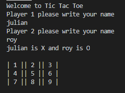

# TIC TAC TOE GAME

> This project is Tic Tac Toe game using RUBY classes, input validation, and object tracking (player moves)

## Built With

- Ruby
- Rubocop Linter

### Prerequisites

- Computer
- Terminal -- any terminal will work just fine.
- Ruby Installed -- version 2.4.X and above

### Setup

- Open your terminal and go to the directory where you want to clone the repo.

- Clone the repository to your local machine. Type "git clone https://github.com/julian3493/Ruby_TicTacToe.git"

- Go to the directory. Type "cd Ruby_TicTacToe"

- Go to the execution file directory. Type "cd bin"

- Run the file. Type "ruby main"

## Game Instructions

- Tic Tac Toe is a game for 2 players who take turns marking the spaces in a 3×3 grid.
- A player wins on putting 3 marks in the same horizontal, vertical or diagonal line.
- When you start the game it will ask you the players' names , PLEASE USE ONLY THE ALPHABETS (A-Za-z) AND NOT NUMBERS.
- The player 1 will use "X" as their mark and always go first, the player 2 will use "O" as their mark.
- You MUST choose numbers from 1 to 9 to select a space on the board.
- After each move you will see a message with your move selected, and the board will be updated with your mark.
- If you try to choose an invalid space, the game will ask you go again to make your move.
- The game will end when there is a winner or when there is no more spaces available in this case there is a draw.
- When the game is ended. It will ask you if want you to play again, PRESS "y" if want to play again or PRESS any key if you want to end the game.
- Enjoy the GAME.

## Authors

👤 **Julian Ramos**

- GitHub: [@julian3493](https://github.com/julian3493)
- Twitter: [@JulianR16893833](https://twitter.com/JulianR16893833)
- LinkedIn: [LinkedIn](https://www.linkedin.com/in/juli%C3%A1n-ricardo-ramos-arevalo-3868ba135/)

👤 **Roy Mukuye**

- GitHub: [@mke2111](https://github.com/mke2111)
- Twitter: [@Roymkenya](https://twitter.com/Roymkenya)
- LinkedIn: [Roy Mukuye](https://www.linkedin.com/in/roy-mukuye-42b07b1b4)

## Future Features

* Play against computer

## Contributing

Contributions, issues, and feature requests are welcome!

Feel free to check the [issues page](https://github.com/julian3493/Ruby_TicTacToe/issue).
